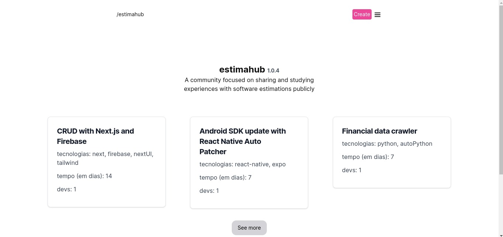

# Project Documentation: estimahub

<p align="center">
   
</p>

## Overview

This project is built using Next.js, a React framework for building server-rendered applications, and follows a serverless architecture utilizing Firebase services. The combination of Next.js and Firebase provides a scalable and efficient solution for developing web applications with dynamic content and serverless functions.

(this documentation have been made with chatGPT)

## Table of Contents (soon)

1. [Getting Started](#getting-started)
2. [Project Structure](#project-structure)
3. [Next.js](#nextjs)
4. [Firebase Services](#firebase-services)
   - [Firestore](#firestore)
   - [Authentication](#authentication)
5. [Development](#development)
6. [Deployment](#deployment)
   - [Firebase Hosting](#firebase-hosting)
7. [Contributing](#contributing)
8. [License](#license)

## Getting Started

### Prerequisites

Before you begin, ensure you have the following installed:

- [Node.js](https://nodejs.org/) version 18.18.2
- [npm](https://www.npmjs.com/) or [Yarn](https://yarnpkg.com/)

### Installation

First of all, create and account at Firebase (if you don't have), create a project and then fill the `.env.local` file with `env.example` variables.

### Clone the repository and setup enviroment:

   ```bash
   git clone https://github.com/henriquesss/estimahub
   cd estimahub
   nvm use (to align your node version)
   npm install 
```

### Contributing
Be free to send PR with the github pattern. 

### License
This project is licensed under the MIT License.